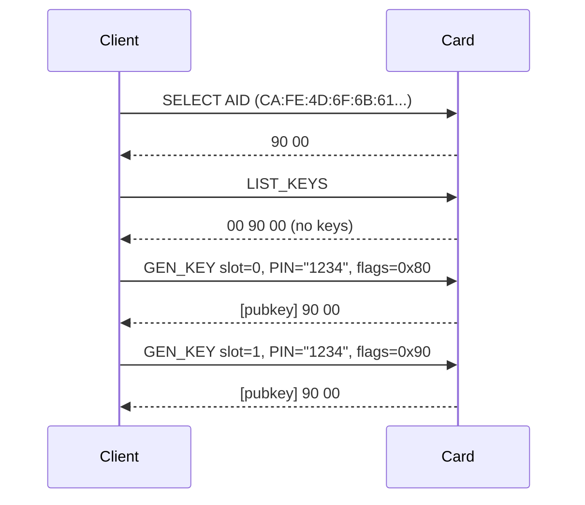
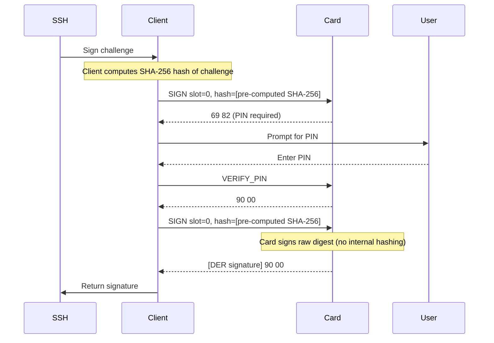
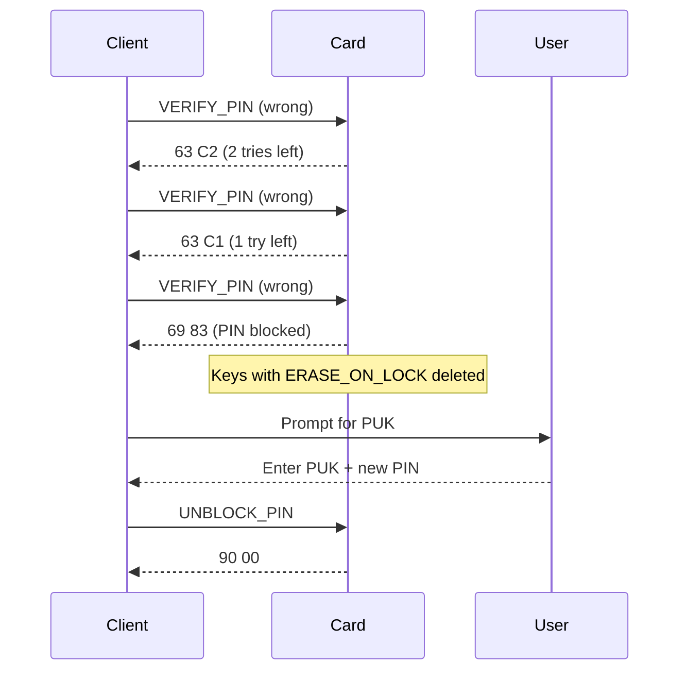

# EspreSSHo APDU Protocol Specification

## Table of Contents

1. [Overview](#overview)
2. [Applet Identification](#applet-identification)  
3. [APDU Format](#apdu-format)
4. [Command Reference](#command-reference)
5. [Response Formats](#response-formats)
6. [Status Words](#status-words)
7. [Security Model](#security-model)
8. [State Machine](#state-machine)
9. [Error Handling](#error-handling)
10. [Implementation Examples](#implementation-examples)
11. [Protocol Flows](#protocol-flows)
12. [Cryptographic Details](#cryptographic-details)

---

## Overview

EspreSSHo implements a JavaCard-based SSH key management system with hardware-backed ECDSA signing on NIST P-256 curves. The protocol provides secure key generation, PIN protection, and signing operations while ensuring private keys never leave the card.

**Key Features:**
- 4 key slots for EC P-256 keypairs
- Per-key security flags (PIN requirements, timeouts, erase-on-lock)
- PIN/PUK authentication with attempt counters
- Hardware-based key generation and signing
- DER-encoded ECDSA signatures

---

## Applet Identification

### Application Identifier (AID)

**Production AID**: `CA FE 4D 6F 6B 61 00 01 00 00 00 00 00 00 00 00` (16 bytes)
- Package AID: `CA FE 4D 6F 6B 61` (6 bytes, "CafeMok[a]")
- Applet Instance: `00 01 00 00 00 00 00 00 00 00` (10 bytes)

### Selection Command
```
CLA INS P1  P2  Lc  Data...                                                   Le
00  A4  04  00  10  CA FE 4D 6F 6B 61 00 01 00 00 00 00 00 00 00 00          00
```

---

## APDU Format

All commands use ISO 7816-4 APDU format:

```
CLA INS P1  P2  [Lc [Data...]] [Le]
```

- **CLA**: Always `0x00` (standard command class)
- **INS**: Instruction byte (see Command Reference)
- **P1**: Parameter 1 (usually key slot 0-3)
- **P2**: Parameter 2 (flags or reserved)
- **Lc**: Data length (present when Data exists)
- **Data**: Command-specific payload
- **Le**: Expected response length (optional)

---

## Command Reference

### INS_GEN_KEY (0x01) - Generate Keypair

**Purpose**: Generate a new EC P-256 keypair in the specified slot.

**APDU Format**:
```
CLA INS P1   P2  Lc  PIN_LEN PIN...   FLAGS
00  01  slot 00  N   len     pin_data flags_byte
```

**Parameters**:
- **P1**: Slot number (0-3)
- **P2**: Reserved (must be 0x00)
- **PIN_LEN**: PIN length in bytes (1-8)
- **PIN**: PIN data (1-8 bytes)
- **FLAGS**: Security flags byte

**Behavior**:
- Fails with `0x6985` if slot already occupied
- Requires valid PIN verification
- Returns 65-byte uncompressed public key on success
- Sets flags for the new keypair

**Example**:
```
Generate key in slot 0 with PIN "1234" and require-PIN flag:
00 01 00 00 06 04 31 32 33 34 80
```

### INS_GET_PUBKEY (0x02) - Get Public Key

**Purpose**: Retrieve the public key from a populated slot.

**APDU Format**:
```
CLA INS P1   P2  Le
00  02  slot 00  00
```

**Parameters**:
- **P1**: Slot number (0-3)
- **P2**: Reserved (must be 0x00)
- **Le**: Expected response length (0x00 = max)

**Response**: 65-byte uncompressed EC point (0x04 || X || Y)

**Example**:
```
Get public key from slot 1:
00 02 01 00 00
```

### INS_SIGN (0x03) - Sign Hash

**Purpose**: Sign a pre-computed hash with the specified key slot.

**APDU Format**:
```
CLA INS P1   P2    Lc  Hash...
00  03  slot flags len digest_data
```

**Parameters**:
- **P1**: Slot number (0-3)
- **P2**: Extra flags (can include `0x80` to force PIN re-verification)
- **Hash**: Pre-computed digest (1-128 bytes, typically 32 for SHA-256)

**Response**: DER-encoded ECDSA signature

**PIN Requirements**: Determined by key flags and P2 parameter

**CRITICAL**: The card does NOT perform hashing. The host MUST pre-compute the hash (SHA-256, SHA-512, etc.) and send only the digest. The card calls `signPreComputedHash()` which signs the raw digest without any internal hashing.

**Example**:
```
Sign SHA-256 hash with slot 0:
00 03 00 00 20 [32 bytes of pre-computed hash data]
```

### INS_LIST_KEYS (0x04) - List Populated Slots

**Purpose**: Return a bitmask of populated key slots.

**APDU Format**:
```
CLA INS P1  P2  Le
00  04  00  00  00
```

**Response**: 1-byte bitmask where bit N indicates slot N has a key

**Example**:
```
List all keys:
00 04 00 00 00

Response: 05 (slots 0 and 2 populated)
```

### INS_VERIFY_PIN (0x05) - Verify PIN

**Purpose**: Verify the card PIN for the current session.

**APDU Format**:
```
CLA INS P1  P2  Lc  PIN...
00  05  00  00  len pin_data
```

**PIN Requirements**: Resets session PIN state; required for protected operations

**Example**:
```
Verify PIN "1234":
00 05 00 00 04 31 32 33 34
```

### INS_CHANGE_PIN (0x06) - Change PIN

**Purpose**: Change the card PIN.

**APDU Format**:
```
CLA INS P1      P2  Lc  OldPIN... NewPIN...
00  06  old_len 00  len old_data  new_data
```

**Parameters**:
- **P1**: Old PIN length in bytes
- **Data**: Old PIN immediately followed by new PIN

**Example**:
```
Change PIN from "1234" to "5678":
00 06 04 00 08 31 32 33 34 35 36 37 38
```

### INS_SET_FLAGS (0x07) - Set Key Flags [DEPRECATED]

**Purpose**: Set security flags for a key slot.

**Status**: Deprecated - use explicit flags in write operations

**APDU Format**:
```
CLA INS P1   P2    
00  07  slot flags
```

### INS_REGEN_KEY (0x08) - Regenerate Keypair

**Purpose**: Replace an existing keypair in the specified slot.

**APDU Format**:
```
CLA INS P1   P2  Lc  PIN_LEN PIN...   FLAGS
00  08  slot 00  N   len     pin_data flags_byte
```

**Behavior**:
- Overwrites existing key (unlike GEN_KEY)
- Requires valid PIN verification
- Sets flags explicitly from command data
- Returns new 65-byte public key

**Example**:
```
Regenerate key in slot 1 with PIN "test":
00 08 01 00 05 04 74 65 73 74 00
```

### INS_UNBLOCK_PIN (0x09) - Unblock PIN

**Purpose**: Unblock a blocked PIN using the PUK.

**APDU Format**:
```
CLA INS P1      P2  Lc  PUK...   NewPIN...
00  09  puk_len 00  len puk_data new_pin_data
```

**Parameters**:
- **P1**: PUK length in bytes
- **Data**: PUK immediately followed by new PIN

**Example**:
```
Unblock PIN with PUK "12345678" and set new PIN to "abcd":
00 09 08 00 0C 31 32 33 34 35 36 37 38 61 62 63 64
```

### INS_CLEAR_KEY (0x0A) - Clear Key Slot

**Purpose**: Securely delete a keypair from the specified slot.

**APDU Format**:
```
CLA INS P1   P2  Lc  PIN_LEN PIN...   FLAGS
00  0A  slot 00  N   len     pin_data reserved
```

**Behavior**:
- Clears key material and flags
- Requires valid PIN verification
- FLAGS parameter ignored (should be 0x00)

**Example**:
```
Clear key from slot 2 with PIN "1234":
00 0A 02 00 06 04 31 32 33 34 00
```

### INS_GET_FLAGS (0x11) - Get Key Flags

**Purpose**: Retrieve security flags for a key slot.

**APDU Format**:
```
CLA INS P1   P2  Le
00  11  slot 00  00
```

**Response**: 1-byte flags value

**Example**:
```
Get flags for slot 0:
00 11 00 00 00
```

---

## Response Formats

### Successful Responses

All successful commands return `SW1=0x90, SW2=0x00` followed by optional data:

| Command | Response Data | Length |
|---------|---------------|---------|
| GEN_KEY | Uncompressed public key | 65 bytes |
| GET_PUBKEY | Uncompressed public key | 65 bytes |
| SIGN | DER-encoded ECDSA signature | Variable (typically 70-72 bytes) |
| LIST_KEYS | Populated slot bitmask | 1 byte |
| REGEN_KEY | New uncompressed public key | 65 bytes |
| GET_FLAGS | Flags byte | 1 byte |
| Others | No data | 0 bytes |

### Public Key Format

All public keys are returned as 65-byte uncompressed EC points:
```
04 || X_coordinate(32) || Y_coordinate(32)
```

### DER Signature Format

ECDSA signatures use standard DER encoding:
```
30 <len> 02 <r_len> <r_value> 02 <s_len> <s_value>
```

For P-256, typical lengths are 70-72 bytes total.

---

## Status Words

### Success Status Words

| SW | Hex | Meaning |
|----|-----|---------|
| SW_SUCCESS | `0x9000` | Command completed successfully |

### Error Status Words

| SW | Hex | Meaning | Context |
|----|-----|---------|---------|
| SW_PIN_BLOCKED | `0x6983` | PIN blocked, PUK required | After final PIN attempt |
| SW_WRONG_PIN_BASE | `0x63C0-0x63CF` | Wrong PIN, N tries remaining | Low nibble = remaining tries |
| SW_KEY_NOT_FOUND | `0x6A82` | Referenced key slot is empty | Access to unpopulated slot |
| SW_SECURITY_STATUS_NOT_SATISFIED | `0x6982` | PIN verification required | PIN-protected operation without auth |
| SW_KEY_EXISTS | `0x6985` | Key slot already occupied | GEN_KEY on populated slot |
| SW_WRONG_LENGTH | `0x6700` | Invalid APDU or data length | Malformed command |
| SW_INS_NOT_SUPPORTED | `0x6D00` | Instruction not supported | Unknown INS byte |
| SW_WRONG_DATA | `0x6A80` | Invalid parameter or data | Reserved flag bits set |

**Note on JavaCard Status Word Limitations**: 
- `SW_CONDITIONS_NOT_SATISFIED` and `SW_KEY_EXISTS` both map to `0x6985` due to JavaCard constraints
- Actual meaning depends on context - GEN_KEY uses it for "slot occupied", other operations may use it differently
- This is a limitation of the JavaCard platform's status word set

### Status Word Examples

```
Success: 90 00
Wrong PIN (2 tries left): 63 C2  
PIN blocked: 69 83
Key not found: 6A 82
Slot occupied: 69 85
```

---

## Security Model

### Key Security Flags

Each key slot has an 8-bit flags byte controlling security behavior:

```
Bit:  7       6  5  4    3        2  1  0
     ┌───────┬──────────┬─────────┬──────┐
     │ REQ   │ TIMEOUT  │ ERASE   │ RES  │
     │ PIN   │ (0–7)    │ ON LOCK │      │
     └───────┴──────────┴─────────┴──────┘
```

| Bit(s) | Flag | Value | Description |
|--------|------|-------|-------------|
| 7 | `FLAG_REQUIRE_PIN` | `0x80` | Require PIN verification before signing |
| 6-4 | `FLAG_TIMEOUT_MASK` | `0x70` | PIN timeout in minutes (0-7) |
| 3 | `FLAG_ERASE_ON_LOCK` | `0x08` | Erase key when PIN becomes blocked |
| 2-0 | Reserved | `0x00` | Must be zero for future compatibility |

### PIN Timeout Behavior

**IMPORTANT**: PIN timeout enforcement is HOST-RESPONSIBILITY, not card-enforced. The card only tracks whether PIN has been verified in the current session.

The timeout field (bits 6-4) is stored in the key flags but timeout logic must be implemented by the client:

- **0**: Session-scoped only (PIN valid until deselect/power-off)
- **1-7**: PIN valid for N minutes after verification (HOST must track timestamps)
- Timeout resets on each successful PIN verification
- Expired timeout requires re-verification for protected operations

The JavaCard applet does NOT implement timeout timers - this is left to the host application.

### PIN Requirements for Signing

A key requires PIN verification for signing if:
1. Key has `FLAG_REQUIRE_PIN` set, AND
2. No valid PIN session exists, OR
3. PIN timeout has expired

Additionally, the P2 parameter in SIGN can force re-verification:
- `P2 = 0x80`: Force PIN verification regardless of current state

### Erase-on-Lock Protection

Keys with `FLAG_ERASE_ON_LOCK` are automatically deleted when:
- PIN becomes blocked (final attempt exhausted)
- PUK becomes blocked (rare, but possible)

This provides "dead man's switch" protection for sensitive keys.

### PIN/PUK Configuration

| Parameter | Default | Range | Behavior |
|-----------|---------|-------|----------|
| PIN | "1234" | 1-8 bytes | Must change for production |
| PUK | "12345678" | 1-8 bytes | Unblocks PIN |
| PIN Max Tries | 3 | Fixed | PIN blocks after exhaustion |
| PUK Max Tries | 5 | Fixed | Card permanently locked if exhausted |

---

## State Machine

### PIN State Transitions

```
[Power On] → [PIN Unknown] 
    ↓ VERIFY_PIN (correct)
[PIN Verified] ←→ [PIN Timeout] 
    ↓ VERIFY_PIN (wrong)         ↑ Timer expiry
[PIN Retry] → [PIN Blocked] → [Unblocked by PUK]
    ↓ Max retries    ↓ UNBLOCK_PIN
[Card Locked]      [PIN Unknown]
```

### Key Slot Lifecycle

```
[Empty Slot] → [GEN_KEY] → [Populated Slot]
                              ↓ CLEAR_KEY
[Empty Slot] ← [REGEN_KEY] ←  [Populated Slot]
                              ↓ Erase-on-Lock
                         [Empty Slot]
```

### Session Management

- **PIN State**: Reset on applet deselect or card power-off
- **Timeout Tracking**: Per-key timeout counters maintained during session
- **Transaction Safety**: All write operations use JavaCard transactions

---

## Error Handling

### Client-Side Error Handling

1. **Status Word Parsing**: Always check SW before processing response data
2. **PIN Retry Logic**: Handle `0x63CX` with appropriate user feedback  
3. **Blocked PIN Recovery**: Guide user through PUK unblock process
4. **Timeout Handling**: Re-prompt for PIN when needed
5. **Slot Management**: Check LIST_KEYS before operations

### Error Recovery Patterns

**Wrong PIN Recovery**:
```
1. Parse remaining tries from SW (0x63CX)
2. Display tries remaining to user
3. Re-prompt for PIN entry
4. If tries exhausted (0x6983), initiate PUK recovery
```

**Slot Collision Recovery**:
```
1. GEN_KEY returns 0x6985 (slot occupied)  
2. Confirm user wants to overwrite
3. Use REGEN_KEY instead of GEN_KEY
```

**PIN Timeout Recovery**:
```
1. SIGN returns 0x6982 (PIN required)
2. Check key flags for timeout behavior
3. Prompt user for PIN re-verification
4. Retry signing operation
```

---

## Implementation Examples

### Complete Key Generation Flow

```bash
# 1. Select applet
Command:  00 A4 04 00 10 CA FE 4D 6F 6B 61 00 01 00 00 00 00 00 00 00 00 00
Response: 90 00

# 2. Check available slots  
Command:  00 04 00 00 00
Response: 03 90 00  # Slots 0,1 occupied; 2,3 free

# 3. Generate key in slot 2 with PIN "test" and require-PIN + timeout
Command:  00 01 02 00 06 04 74 65 73 74 90  # flags=0x90 (PIN+1min timeout)
Response: 04 [64 bytes of public key] 90 00
```

### Signing Operation with PIN

```bash
# 1. Attempt to sign (may need PIN) - NOTE: hash must be pre-computed by host
Command:  00 03 02 00 20 [32 bytes pre-computed SHA-256 hash]
Response: 69 82  # PIN verification required

# 2. Verify PIN
Command:  00 05 00 00 04 74 65 73 74
Response: 90 00

# 3. Retry signing - card will sign the raw digest without re-hashing
Command:  00 03 02 00 20 [32 bytes pre-computed SHA-256 hash]  
Response: [DER signature] 90 00
```

### PIN Change Operation

```bash
# Change PIN from "1234" to "newpin"
Command:  00 06 04 00 0A 31 32 33 34 6E 65 77 70 69 6E
Response: 90 00
```

### PIN Unblock with PUK

```bash
# Unblock with PUK "12345678", set new PIN "abcd"
Command:  00 09 08 00 0C 31 32 33 34 35 36 37 38 61 62 63 64
Response: 90 00
```

### Error Handling Examples

```bash
# Wrong PIN with 2 tries remaining
Command:  00 05 00 00 04 77 72 6F 6E 67  # "wrong"
Response: 63 C2

# PIN blocked
Command:  00 05 00 00 04 77 72 6F 6E 67
Response: 69 83

# Slot already occupied
Command:  00 01 00 00 06 04 31 32 33 34 80
Response: 69 85

# Key not found (empty slot)
Command:  00 02 03 00 00  # Get key from empty slot 3
Response: 6A 82
```

---

## Protocol Flows

### Initial Setup Flow



### SSH Authentication Flow



### PIN Blocked Recovery Flow



---

## Cryptographic Details

### Elliptic Curve Parameters

**Curve**: NIST P-256 (secp256r1)
- **Field Prime**: `p = 2^256 - 2^224 + 2^192 + 2^96 - 1`
- **Curve Equation**: `y^2 = x^3 - 3x + b`
- **Generator Order**: 256 bits
- **Cofactor**: 1

### Key Generation

- **Algorithm**: EC key pair generation on P-256
- **Randomness**: JavaCard secure random number generator
- **Storage**: Private key never leaves card; public key exportable
- **Format**: Private key in JavaCard ECPrivateKey object

### Signature Algorithm

- **Algorithm**: ECDSA with pre-computed hash
- **Hash Algorithm**: HOST RESPONSIBILITY - performed by client (SHA-256, SHA-512, etc.)
- **Card Behavior**: Uses `Signature.signPreComputedHash()` - NO internal hashing
- **Signature Format**: DER-encoded as per RFC 3279
- **Curve**: NIST P-256 only

**CRITICAL**: Despite using `ALG_ECDSA_SHA_256` for the signature instance, the card calls `signPreComputedHash()` which bypasses internal hashing. The host must pre-hash all data.

### Public Key Encoding

Public keys are always returned as 65-byte uncompressed points:
```
0x04 || X_coordinate (32 bytes) || Y_coordinate (32 bytes)
```

This format is compatible with:
- OpenSSH `ecdsa-sha2-nistp256` keys
- X.509 SubjectPublicKeyInfo structures  
- Raw EC point formats

### PIN Security

- **Storage**: JavaCard OwnerPIN objects (hardware-protected)
- **Attempts**: Hardware attempt counters (cannot be bypassed)
- **Blocking**: Automatic after max attempts exceeded
- **Verification**: Constant-time comparison (side-channel resistant)

---

## Version History

### API Changes

1. **Unified PIN-Protected Format**: GEN_KEY, REGEN_KEY, CLEAR_KEY use `[PIN_LEN][PIN][FLAGS]`
2. **PIN Protection**: All write operations now require PIN verification
3. **Slot Protection**: GEN_KEY fails on occupied slots; use REGEN_KEY to replace
4. **Explicit Flags**: REGEN_KEY sets flags explicitly instead of preserving existing
5. **Error Codes**: New status words for key existence and security violations

### v1.x Legacy Format

- GEN_KEY: No data field (PIN not required)
- REGEN_KEY: No data field (PIN not required)
- SET_FLAGS: Separate operation for flag management
- No CLEAR_KEY operation

**Migration Required**: This implementation is not backward compatible with previous versions.

---

## Implementation Notes

### Thread Safety

- **Card Access**: Serialize all APDU operations with mutex protection
- **State Management**: PIN state is session-local, not shared between operations
- **Error Recovery**: Each operation should be atomic and recoverable

### Performance Considerations

- **PIN Caching**: Client should cache PIN verification status with timeout tracking
- **Batch Operations**: Minimize card round-trips where possible  
- **Error Handling**: Fast-fail on invalid parameters before sending APDUs

### Security Best Practices

1. **PIN Handling**: Zero PIN bytes after use; avoid logging PIN values
2. **Default PINs**: Change default PIN/PUK before production deployment
3. **Erase-on-Lock**: Use for sensitive keys requiring "dead man's switch" protection
4. **Timeout Configuration**: Set appropriate PIN timeouts for usage patterns
5. **Error Messages**: Don't leak timing information in error responses

### Testing and Validation

- **Unit Tests**: Test all APDU commands with various parameter combinations
- **Error Path Testing**: Verify all error conditions and recovery flows
- **PIN Blocking**: Test PIN/PUK blocking and recovery scenarios
- **Flag Behavior**: Verify timeout and erase-on-lock functionality
- **Cryptographic Validation**: Verify signature correctness with known test vectors

---

*This specification covers the EspreSSHo APDU Protocol. For implementation questions or clarifications, refer to the reference implementations in `mokapot/` (JavaCard applet) and `barista/` (Go client).*