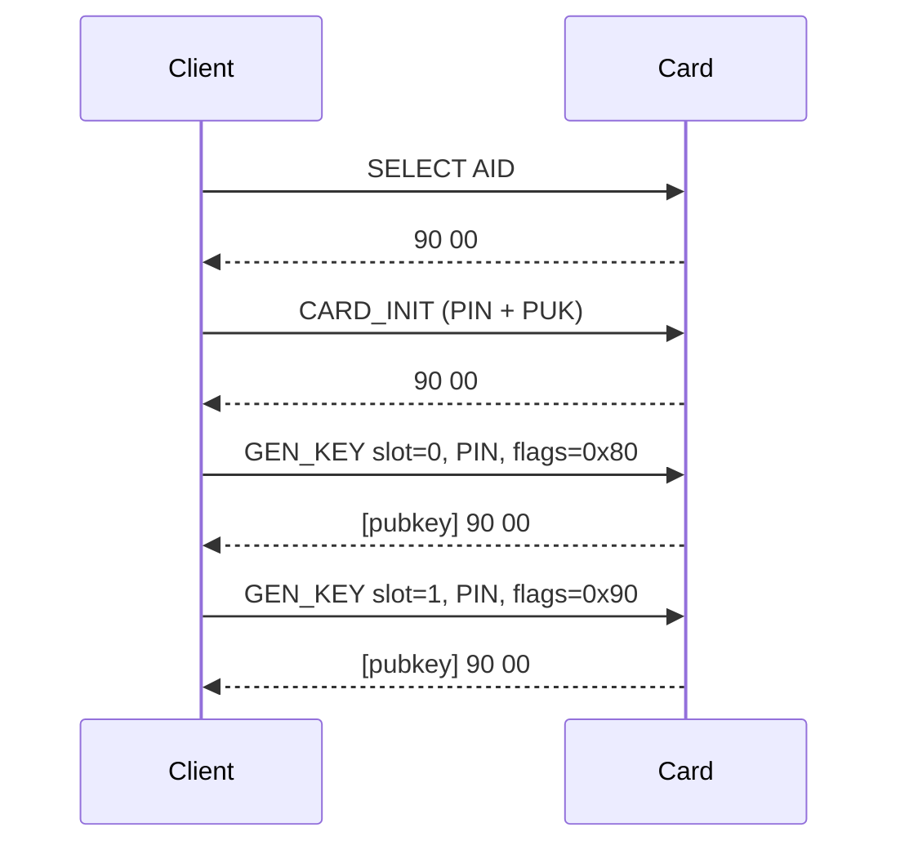
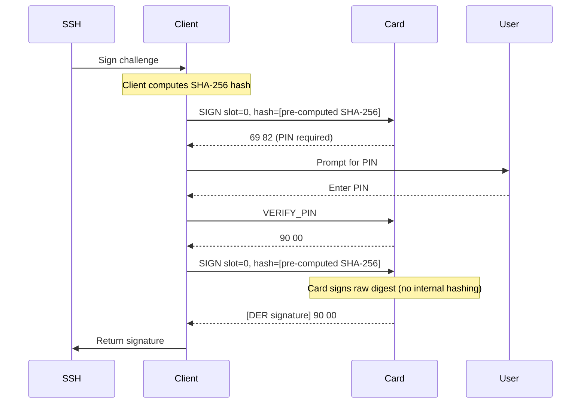
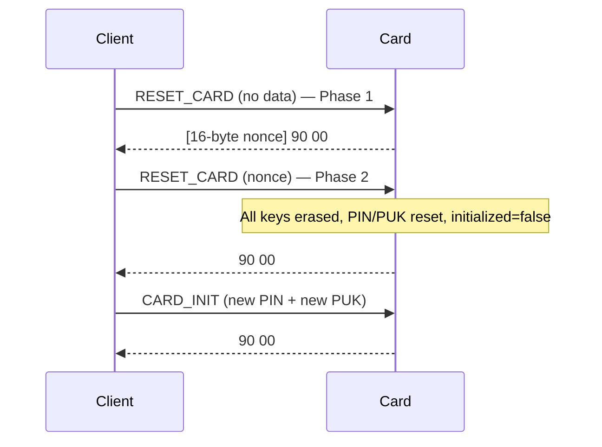

# EspreSSHo APDU Protocol Specification

## Table of Contents

1. [Overview](#overview)
2. [Applet Identification](#applet-identification)
3. [APDU Format](#apdu-format)
4. [Card Lifecycle](#card-lifecycle)
5. [Command Reference — Normal Operations (0x01–0x08)](#command-reference--normal-operations)
6. [Command Reference — Admin Block (0x7F–0x7B)](#command-reference--admin-block)
7. [Response Formats](#response-formats)
8. [Status Words](#status-words)
9. [Security Model](#security-model)
10. [State Machine](#state-machine)
11. [Error Handling](#error-handling)
12. [Implementation Examples](#implementation-examples)
13. [Protocol Flows](#protocol-flows)
14. [Cryptographic Details](#cryptographic-details)

---

## Overview

EspreSSHo implements a JavaCard-based SSH key management system with hardware-backed ECDSA signing on NIST P-256 curves. The protocol provides secure key generation, PIN protection, and signing operations while ensuring private keys never leave the card.

**Key Features:**
- 4 key slots for EC P-256 keypairs
- Per-key security flags (PIN requirements, timeouts, erase-on-lock)
- PIN/PUK authentication with hardware attempt counters
- Hardware-based key generation and signing
- DER-encoded ECDSA signatures
- Card lifecycle management with one-time initialization and factory reset

---

## Applet Identification

### Application Identifier (AID)

**Production AID**: `CA FE 4D 6F 6B 61 00 01 00 00 00 00 00 00 00 00` (16 bytes)
- Package AID: `CA FE 4D 6F 6B 61` (6 bytes, "CafeMok[a]")
- Applet Instance: `00 01 00 00 00 00 00 00 00 00` (10 bytes)

### Selection Command
```
CLA INS P1  P2  Lc  Data...                                                   Le
00  A4  04  00  10  CA FE 4D 6F 6B 61 00 01 00 00 00 00 00 00 00 00          00
```

---

## APDU Format

All commands use ISO 7816-4 APDU format:

```
CLA INS P1  P2  [Lc [Data...]] [Le]
```

- **CLA**: Always `0x00` (standard command class)
- **INS**: Instruction byte (see Command Reference)
- **P1**: Parameter 1 (usage varies by instruction)
- **P2**: Parameter 2 (flags or reserved)
- **Lc**: Data length (present when Data exists)
- **Data**: Command-specific payload
- **Le**: Expected response length (optional)

### Instruction Numbering

Instructions are split into two ranges:

| Range | Purpose |
|-------|---------|
| `0x01`–`0x08` | Normal card operations (key management, signing, PIN verification) |
| `0x7F`–`0x7B` | Admin block: card lifecycle management |

The admin block counts downward from `0x7F`. `0x70` (ISO 7816-4 MANAGE CHANNEL, JCRE-intercepted) is the hard floor — reaching it would indicate more than 15 admin instructions. All values `0x7B`–`0x7F` are free of ISO 7816-4 and JCRE conflicts.

---

## Card Lifecycle

A freshly installed card is **uninitialized**. In this state only two things work:

1. **SELECT** — accepted by the framework, returns `9000`
2. **INS_CARD_INIT (0x7F)** — sets PIN and PUK, marks card initialized

Every other instruction on an uninitialized card returns `SW_SECURITY_STATUS_NOT_SATISFIED` (`0x6982`).

After initialization the full instruction set is available. The card remains initialized across power cycles (the flag is stored in EEPROM).

**INS_RESET_CARD (0x7B)** is the only way to return to the uninitialized state. It is a two-phase, credential-free "blow everything away" reset — the escape hatch for permanent lockout or card handoff.

---

## Command Reference — Normal Operations

### Unified PIN-Protected Write Format

`INS_GEN_KEY`, `INS_REGEN_KEY`, and `INS_CLEAR_KEY` share a common data format:

```
CLA INS P1   P2  Lc  PIN_LEN  PIN...   FLAGS
00  XX  slot 00  N   len      pin_data flags_byte
```

- **PIN_LEN**: 1 byte (1–8)
- **PIN**: variable-length PIN (1–8 bytes)
- **FLAGS**: security flags byte (see §Security Model)
- **Lc**: `1 + PIN_LEN + 1` (PIN_LEN byte + PIN bytes + FLAGS byte)

---

### INS_GEN_KEY (0x01) — Generate Keypair

**Purpose**: Generate a new EC P-256 keypair in the specified slot.

**APDU**:
```
CLA INS P1   P2  Lc  PIN_LEN PIN...   FLAGS
00  01  slot 00  N   len     pin_data flags_byte
```

**Behavior**:
- Fails with `0x6985` if slot already occupied — use `INS_REGEN_KEY` to replace
- Requires valid PIN
- Returns 65-byte uncompressed public key on success

**Example** — slot 0, PIN "1234", FLAG_REQUIRE_PIN:
```
00 01 00 00 06 04 31 32 33 34 80
```

---

### INS_GET_PUBKEY (0x02) — Get Public Key

**Purpose**: Retrieve the 65-byte uncompressed public key from a slot.

**APDU**:
```
CLA INS P1   P2  Le
00  02  slot 00  00
```

**Response**: 65-byte uncompressed EC point (`0x04` || X || Y). No PIN required.

**Example** — slot 1:
```
00 02 01 00 00
```

---

### INS_SIGN (0x03) — Sign Hash

**Purpose**: Sign a pre-computed hash with the key in a slot.

**APDU**:
```
CLA INS P1   P2    Lc  Hash...
00  03  slot flags len digest_data
```

- **P2 flags**: `0x80` (`FLAG_REQUIRE_PIN`) forces PIN re-verification regardless of slot flags
- **Hash**: pre-computed digest (1–128 bytes; typically 32 bytes for SHA-256)
- **Response**: DER-encoded ECDSA signature

**CRITICAL**: The card does NOT hash the data. The host MUST pre-compute the hash and send only the digest. The card calls `signPreComputedHash()` which signs the raw digest without any internal hashing.

**Example** — slot 0, SHA-256 hash:
```
00 03 00 00 20 [32 bytes of pre-computed hash]
```

---

### INS_LIST_KEYS (0x04) — List Populated Slots

**Purpose**: Return a bitmask of populated key slots.

**APDU**:
```
CLA INS P1  P2  Le
00  04  00  00  00
```

**Response**: 1-byte bitmask — bit N set means slot N has a key. No PIN required.

**Example**:
```
00 04 00 00 00
Response: 05  (slots 0 and 2 populated)
```

---

### INS_VERIFY_PIN (0x05) — Verify PIN

**Purpose**: Verify the card PIN for the current session.

**APDU**:
```
CLA INS P1  P2  Lc  PIN...
00  05  00  00  len pin_data
```

On failure returns `0x63Cx` (x = tries remaining) or `0x6983` (blocked). On exhaustion, keys with `FLAG_ERASE_ON_LOCK` are deleted.

**Example** — PIN "1234":
```
00 05 00 00 04 31 32 33 34
```

---

### INS_REGEN_KEY (0x06) — Regenerate Keypair

**Purpose**: Replace the keypair in a slot (works on empty or occupied slots).

**APDU**: same unified format as `INS_GEN_KEY`.
```
CLA INS P1   P2  Lc  PIN_LEN PIN...   FLAGS
00  06  slot 00  N   len     pin_data flags_byte
```

**Behavior**:
- Overwrites any existing key (no occupancy check)
- Sets flags explicitly from APDU — previous flags are **not** preserved
- Returns new 65-byte public key

**Example** — slot 1, PIN "test", no flags:
```
00 06 01 00 06 04 74 65 73 74 00
```

---

### INS_CLEAR_KEY (0x07) — Clear Key Slot

**Purpose**: Securely delete a keypair and its flags from a slot.

**APDU**: same unified format; FLAGS field must be valid but is ignored.
```
CLA INS P1   P2  Lc  PIN_LEN PIN...   FLAGS
00  07  slot 00  N   len     pin_data 00
```

Safe to call on an empty slot (no-op).

**Example** — slot 2, PIN "1234":
```
00 07 02 00 06 04 31 32 33 34 00
```

---

### INS_GET_FLAGS (0x08) — Get Key Flags

**Purpose**: Retrieve the security flags byte for a slot.

**APDU**:
```
CLA INS P1   P2  Le
00  08  slot 00  00
```

**Response**: 1-byte flags value. No PIN required.

**Example** — slot 0:
```
00 08 00 00 00
```

---

## Command Reference — Admin Block

### INS_CARD_INIT (0x7F) — One-Time Initialization

**Purpose**: Set the card PIN and PUK for the first time. This is the only instruction accepted on an uninitialized card (besides SELECT).

**APDU**:
```
CLA INS P1       P2       Lc           Data
00  7F  PIN_LEN  PUK_LEN  PIN+PUK len  [PIN bytes] || [PUK bytes]
```

- **P1**: PIN length in bytes (1–8)
- **P2**: PUK length in bytes (1–8)
- **Lc**: P1 + P2
- **Data**: PIN bytes immediately followed by PUK bytes

Calling on an already-initialized card returns `SW_SECURITY_STATUS_NOT_SATISFIED` (`0x6982`).

**Example** — PIN "1234" (4 bytes), PUK "87654321" (8 bytes):
```
00 7F 04 08 0C 31 32 33 34 38 37 36 35 34 33 32 31
```

---

### INS_SET_PIN (0x7E) — Change PIN

**Purpose**: Change the card PIN.

**APDU**:
```
CLA INS P1      P2  Lc  OldPIN... NewPIN...
00  7E  old_len 00  len old_data  new_data
```

- **P1**: Old PIN length in bytes
- **Data**: Old PIN immediately followed by new PIN

Does not require a prior `INS_VERIFY_PIN` — the old PIN is verified inline.

**Example** — change PIN from "1234" to "5678":
```
00 7E 04 00 08 31 32 33 34 35 36 37 38
```

---

### INS_SET_PUK (0x7D) — Change PUK

**Purpose**: Change the card PUK.

**APDU**:
```
CLA INS P1      P2  Lc  OldPUK... NewPUK...
00  7D  old_len 00  len old_data  new_data
```

- **P1**: Old PUK length in bytes
- **Data**: Old PUK immediately followed by new PUK

If the PUK try counter is permanently exhausted, only `INS_RESET_CARD` can recover.

**Example** — change PUK from "12345678" to "abcdefgh":
```
00 7D 08 00 10 31 32 33 34 35 36 37 38 61 62 63 64 65 66 67 68
```

---

### INS_UNBLOCK_CARD (0x7C) — Unblock PIN

**Purpose**: Unblock a blocked PIN using the PUK and set a new PIN value.

**APDU**:
```
CLA INS P1      P2  Lc  PUK...   NewPIN...
00  7C  puk_len 00  len puk_data new_pin_data
```

- **P1**: PUK length in bytes
- **Data**: PUK immediately followed by new PIN

Resets the PIN try counter and activates the new PIN. If the PUK is also exhausted, returns `SW_PIN_BLOCKED` (`0x6983`) — only `INS_RESET_CARD` can recover.

**Example** — PUK "12345678", new PIN "abcd":
```
00 7C 08 00 0C 31 32 33 34 35 36 37 38 61 62 63 64
```

---

### INS_RESET_CARD (0x7B) — Factory Reset (Two-Phase)

**Purpose**: Wipe all keys and credentials, returning the card to the freshly installed (uninitialized) state. No PIN or PUK is required — this is the "I forgot everything" escape hatch.

**Two-phase protocol to prevent accidental resets:**

#### Phase 1 — request nonce (no data)

```
CLA INS P1  P2  Le
00  A4  00  00  00
```

Response: 16 random bytes (the nonce). The nonce is stored in transient memory (`CLEAR_ON_DESELECT`). If you deselect the card before completing Phase 2, the nonce is gone — restart from Phase 1.

#### Phase 2 — confirm with nonce

```
CLA INS P1  P2  Lc  Nonce...
00  A4  00  00  10  [16 bytes returned by Phase 1]
```

- **Match**: card atomically erases all key material, resets PIN/PUK counters, sets `initialized = false`. Returns `9000`.
- **Mismatch**: nonce is immediately invalidated; returns `SW_SECURITY_STATUS_NOT_SATISFIED` (`0x6982`). No retries — restart from Phase 1.

After a successful reset, `INS_CARD_INIT` must be called before any other instruction.

**Example session**:
```bash
# Phase 1 — get nonce
Command:  00 7B 00 00 00
Response: [16 nonce bytes] 90 00

# Phase 2 — confirm reset
Command:  00 7B 00 00 10 [same 16 nonce bytes]
Response: 90 00
```

---

## Response Formats

### Successful Responses

All successful commands return `SW1=0x90, SW2=0x00` followed by optional data:

| Command | Response Data | Length |
|---------|---------------|---------|
| GEN_KEY | Uncompressed public key | 65 bytes |
| GET_PUBKEY | Uncompressed public key | 65 bytes |
| SIGN | DER-encoded ECDSA signature | Variable (typically 70–72 bytes) |
| LIST_KEYS | Populated slot bitmask | 1 byte |
| REGEN_KEY | New uncompressed public key | 65 bytes |
| GET_FLAGS | Flags byte | 1 byte |
| RESET_CARD Phase 1 | Nonce | 16 bytes |
| Others | No data | 0 bytes |

### Public Key Format

All public keys are returned as 65-byte uncompressed EC points:
```
04 || X_coordinate(32) || Y_coordinate(32)
```

### DER Signature Format

ECDSA signatures use standard DER encoding:
```
30 <len> 02 <r_len> <r_value> 02 <s_len> <s_value>
```

For P-256, typical total length is 70–72 bytes.

---

## Status Words

### Success

| SW | Hex | Meaning |
|----|-----|---------|
| SW_SUCCESS | `0x9000` | Command completed successfully |

### Errors

| SW | Hex | Meaning | Context |
|----|-----|---------|---------|
| SW_PIN_BLOCKED | `0x6983` | PIN or PUK blocked | After exhausting try counter |
| SW_WRONG_PIN_BASE | `0x63C0`–`0x63CF` | Wrong PIN/PUK, N tries left | Low nibble = remaining tries |
| SW_KEY_NOT_FOUND | `0x6A82` | Referenced key slot is empty | Access to unpopulated slot |
| SW_SECURITY_STATUS_NOT_SATISFIED | `0x6982` | Security condition not met | Uninitialized card, PIN required, wrong reset nonce |
| SW_KEY_EXISTS | `0x6985` | Key slot already occupied | GEN_KEY on populated slot |
| SW_WRONG_LENGTH | `0x6700` | Invalid APDU or data length | Malformed command |
| SW_INS_NOT_SUPPORTED | `0x6D00` | Instruction not supported | Unknown INS byte |
| SW_WRONG_DATA | `0x6A80` | Invalid data | Reserved flag bits set |

### Status Word Examples

```
Success:                  90 00
Wrong PIN, 2 tries left:  63 C2
PIN blocked:              69 83
Key not found:            6A 82
Slot occupied:            69 85
Card not initialized:     69 82
Wrong reset nonce:        69 82
```

---

## Security Model

### Card Initialization Gate

An uninitialized card (freshly installed, or after `INS_RESET_CARD`) responds only to SELECT and `INS_CARD_INIT`. Every other instruction returns `0x6982`. This prevents any key or signing operations before credentials are established.

### Key Security Flags

Each key slot has an 8-bit flags byte controlling security behavior:

```
Bit:  7       6  5  4    3        2  1  0
     ┌───────┬──────────┬─────────┬──────┐
     │ REQ   │ TIMEOUT  │ ERASE   │ RES  │
     │ PIN   │ (0–7)    │ ON LOCK │      │
     └───────┴──────────┴─────────┴──────┘
```

| Bit(s) | Flag | Value | Description |
|--------|------|-------|-------------|
| 7 | `FLAG_REQUIRE_PIN` | `0x80` | Require PIN verification before signing |
| 6-4 | `FLAG_TIMEOUT_MASK` | `0x70` | PIN timeout in minutes (0–7) |
| 3 | `FLAG_ERASE_ON_LOCK` | `0x08` | Erase key when PIN becomes blocked |
| 2-0 | Reserved | `0x00` | Must be zero for future compatibility |

### PIN Timeout Behavior

**IMPORTANT**: PIN timeout enforcement is the **host's responsibility**, not card-enforced. The card only tracks whether the PIN has been verified in the current session.

- **0**: Session-scoped only (PIN valid until deselect/power-off)
- **1–7**: PIN valid for N minutes after verification (HOST must track timestamps)

### PIN Requirements for Signing

A key requires PIN verification for signing if:
1. Key has `FLAG_REQUIRE_PIN` set, AND
2. No valid PIN session exists, OR
3. PIN timeout has expired (host-tracked)

`P2 = 0x80` in SIGN forces re-verification regardless of session state.

### Erase-on-Lock Protection

Keys with `FLAG_ERASE_ON_LOCK` are automatically deleted when the PIN try counter reaches zero. This provides "dead man's switch" protection for sensitive keys.

### Factory Reset

`INS_RESET_CARD` requires no credentials by design — it is the escape hatch when all credentials are lost. The two-phase nonce prevents accidental reset from a single malformed APDU. The nonce is stored in transient memory and is cleared if the card is deselected between phases.

---

## State Machine

### Card Initialization State

```
[Installed / Post-Reset]
        │ INS_CARD_INIT
        ▼
[Initialized]  ←──────────────────────────────────────────┐
        │                                                   │
        │ (all normal and admin operations available)       │
        │                                                   │
        │ INS_RESET_CARD (Phase 1 + Phase 2)               │
        └───────────────────────────────────────────────────
```

### PIN State Transitions

```
[Power On / Deselect] → [PIN Not Verified]
    ↓ VERIFY_PIN (correct)
[PIN Verified] ←→ [Timeout — host-tracked]
    ↓ VERIFY_PIN (wrong, tries > 0)
[Wrong PIN — 63Cx]
    ↓ tries exhausted
[PIN Blocked — 6983] → UNBLOCK_CARD → [PIN Not Verified]
                     → RESET_CARD   → [Uninitialized]
```

### Key Slot Lifecycle

```
[Empty Slot] → GEN_KEY  → [Populated Slot]
                            ↓ CLEAR_KEY
[Empty Slot] ← REGEN_KEY ←  [Populated Slot]
                            ↓ Erase-on-Lock
                       [Empty Slot]
```

---

## Error Handling

### Client-Side Error Handling

1. **Status Word Parsing**: Always check SW before processing response data
2. **PIN Retry Logic**: Handle `0x63CX` with appropriate user feedback
3. **Blocked PIN Recovery**: Guide user through `UNBLOCK_CARD` or `RESET_CARD`
4. **Uninitialized Card**: On `0x6982` from a non-PIN command, check if `CARD_INIT` is needed
5. **Slot Management**: Check `LIST_KEYS` before operations

### Error Recovery Patterns

**Uninitialized card:**
```
1. Any instruction returns 0x6982
2. Send INS_CARD_INIT with desired PIN and PUK
3. Retry original operation
```

**Wrong PIN:**
```
1. Parse remaining tries from SW (0x63CX)
2. Display tries remaining to user
3. Re-prompt for PIN
4. If tries exhausted (0x6983), use UNBLOCK_CARD or RESET_CARD
```

**Slot collision (GEN_KEY):**
```
1. GEN_KEY returns 0x6985 (slot occupied)
2. Confirm user wants to overwrite
3. Use REGEN_KEY instead
```

**Locked out of everything:**
```
1. Send INS_RESET_CARD (no data) → get 16-byte nonce
2. Send INS_RESET_CARD with nonce as data → card wiped, 9000
3. Send INS_CARD_INIT with new PIN and PUK
4. Regenerate keys as needed
```

---

## Implementation Examples

### First-Time Card Setup

```bash
# 1. Select applet
Command:  00 A4 04 00 10 CA FE 4D 6F 6B 61 00 01 00 00 00 00 00 00 00 00 00
Response: 90 00

# 2. Initialize card with PIN "1234" (4 bytes) and PUK "12345678" (8 bytes)
Command:  00 7F 04 08 0C 31 32 33 34 31 32 33 34 35 36 37 38
Response: 90 00

# 3. Generate key in slot 0 with PIN and require-PIN flag
Command:  00 01 00 00 06 04 31 32 33 34 80
Response: 04 [64 bytes of public key] 90 00
```

### Signing Operation with PIN

```bash
# 1. Attempt to sign (key has FLAG_REQUIRE_PIN)
Command:  00 03 00 00 20 [32 bytes pre-computed SHA-256 hash]
Response: 69 82  (PIN required)

# 2. Verify PIN
Command:  00 05 00 00 04 31 32 33 34
Response: 90 00

# 3. Retry signing
Command:  00 03 00 00 20 [32 bytes pre-computed SHA-256 hash]
Response: [DER signature] 90 00
```

### Change PIN

```bash
# Change PIN from "1234" to "newpin" (6 bytes)
Command:  00 7E 04 00 0A 31 32 33 34 6E 65 77 70 69 6E
Response: 90 00
```

### Unblock PIN with PUK

```bash
# Unblock with PUK "12345678", set new PIN "abcd"
Command:  00 7C 08 00 0C 31 32 33 34 35 36 37 38 61 62 63 64
Response: 90 00
```

### Factory Reset (locked out)

```bash
# Phase 1: get nonce
Command:  00 7B 00 00 00
Response: [16 nonce bytes] 90 00

# Phase 2: confirm reset
Command:  00 7B 00 00 10 [same 16 nonce bytes]
Response: 90 00

# Card is now uninitialized — re-initialize
Command:  00 7F 04 08 0C 31 32 33 34 31 32 33 34 35 36 37 38
Response: 90 00
```

---

## Protocol Flows

### First-Time Setup Flow



### SSH Authentication Flow



### PIN Blocked Recovery Flow


### Factory Reset Flow



---

## Cryptographic Details

### Elliptic Curve Parameters

**Curve**: NIST P-256 (secp256r1)
- **Field Prime**: `p = 2^256 - 2^224 + 2^192 + 2^96 - 1`
- **Curve Equation**: `y^2 = x^3 - 3x + b`
- **Generator Order**: 256 bits
- **Cofactor**: 1

### Key Generation

- **Algorithm**: EC key pair generation on P-256
- **Randomness**: JavaCard secure random number generator
- **Storage**: Private key never leaves card; public key exportable
- **Format**: Private key in JavaCard `ECPrivateKey` object

### Signature Algorithm

- **Algorithm**: ECDSA with pre-computed hash
- **Hash Algorithm**: HOST RESPONSIBILITY — computed by client (SHA-256, SHA-512, etc.)
- **Card Behavior**: Uses `Signature.signPreComputedHash()` — NO internal hashing
- **Signature Format**: DER-encoded per RFC 3279
- **Curve**: NIST P-256 only

**CRITICAL**: Despite using `ALG_ECDSA_SHA_256` for the Signature instance, the card calls `signPreComputedHash()` which bypasses internal hashing. The host must pre-hash all data.

### Factory Reset Nonce

- **Size**: 16 bytes (128 bits)
- **Source**: `RandomData.ALG_SECURE_RANDOM`
- **Storage**: Transient memory, `CLEAR_ON_DESELECT`
- **Comparison**: `Util.arrayCompare()` — constant-time on compliant implementations

### Public Key Encoding

Public keys are always returned as 65-byte uncompressed points:
```
0x04 || X_coordinate (32 bytes) || Y_coordinate (32 bytes)
```

Compatible with OpenSSH `ecdsa-sha2-nistp256`, X.509 SubjectPublicKeyInfo, and raw EC point formats.

### PIN Security

- **Storage**: JavaCard `OwnerPIN` objects (hardware-protected)
- **Attempts**: Hardware attempt counters (cannot be bypassed in software)
- **Blocking**: Automatic after max attempts exceeded
- **Verification**: Constant-time comparison (side-channel resistant)

---

## Version History

### v2.0 — Admin block + card lifecycle

- **Removed**: `INS_CHANGE_PIN (0x06)`, `INS_SET_FLAGS (0x07)`, `INS_UNBLOCK_PIN (0x09)`
- **Renumbered**: `INS_REGEN_KEY` 0x08→0x06, `INS_CLEAR_KEY` 0x0A→0x07, `INS_GET_FLAGS` 0x11→0x08
- **Added admin block**: `INS_CARD_INIT (0x7F)`, `INS_SET_PIN (0x7E)`, `INS_SET_PUK (0x7D)`, `INS_UNBLOCK_CARD (0x7C)`, `INS_RESET_CARD (0x7B)`
- **Added initialization gate**: uninitialized cards reject all instructions except SELECT and CARD_INIT
- **No default PIN/PUK**: credentials are set explicitly by CARD_INIT

### v1.1 — Unified PIN-protected format

- GEN_KEY, REGEN_KEY, CLEAR_KEY use `[PIN_LEN][PIN][FLAGS]` format
- All write operations require PIN verification
- GEN_KEY fails on occupied slots; use REGEN_KEY to replace
- New error code SW_KEY_EXISTS (0x6985)

### v1.0

- GEN_KEY with no PIN requirement
- Separate SET_FLAGS operation
- No CLEAR_KEY operation

**Migration required**: v2.0 is not backward compatible with v1.x.

---

*For implementation questions, refer to the reference implementations in `mokapot/` (JavaCard applet) and `barista/` (Go client).*
